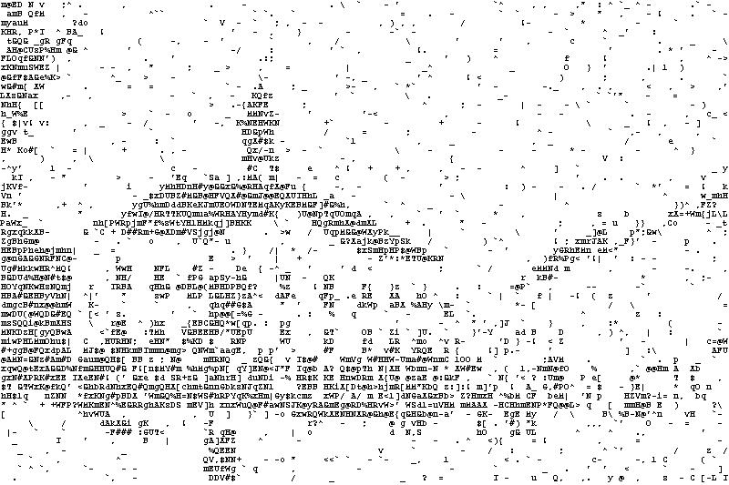

# Evolution algorithms for ASCII art
## Donatas Vaiciukevičius, Dzvenymyra-Marta Yarish, Nikita Fordui

This is repository for University of Tartu Algorithmics course project.

### Description

Evolution algorithms (EAs) are a class of nature-inspired direct 
search methods which maintain a population of candidate solutions 
and use random mutations to evolve more fit ones, 
as is measured by the objective function. 

They are typically used to provide good
approximate solutions to problems that cannot be
solved easily using other techniques. An EA, free of any
human biases, can generate surprising solutions that can
even be better than the best human-generated efforts.

The idea of ASCII art is to recreate images using only a
set of characters defined by the ASCII standard. Such art
can be used to display visual concepts in settings where
no drawing tools are present, i.e. the command line.
Inspired by recent advances in using EAs for digital art
generation, we decided to evaluate the potential of EAs
in ASCII art creation.

### Results

Below are the ASCII results of our algorithm. More results and some gif visualsations can be found under the **./results** directory

/result.jpeg)

### Project structure

**utils** folder contains different helping files such as font file used, script to create GIF and scripts to run code on HPC

**source_imgs** folder contains source images used

**results** folder contains all resulting ASCII art images

